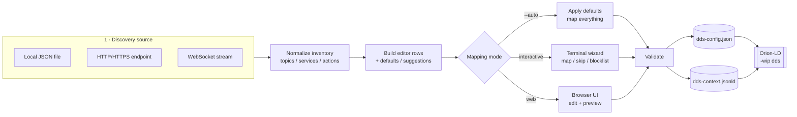

# DDS → NGSI-LD Mapper

> Generate the `dds-config.json` and `@context` (`dds-context.jsonld`) files that
> [Orion-LD](https://github.com/FIWARE/context.Orion-LD) needs to bridge a **DDS / ROS 2**
> system into the **NGSI-LD** information model.

`dds-ngsi-mapper` discovers the topics, services and actions exposed by a DDS domain
(through a DDS Enabler discovery endpoint, a snapshot file, or a live WebSocket stream),
lets you decide **what to expose and how to model it** in NGSI-LD, and emits the two
configuration artifacts that Orion-LD consumes:

```
orionld -wip dds --config out/dds-config.json -duc out/dds-context.jsonld
```

You can drive it three ways: a **non-interactive CLI** (great for CI/Docker), an
**interactive terminal wizard**, or a **browser-based web UI** with live previews.

<sub>Developed within the [ARISE](https://www.arise-middleware.eu/) European project — middleware interoperability for robotics and the FIWARE ecosystem.</sub>

---

## Table of contents

- [Why this exists](#why-this-exists)
- [Key features](#key-features)
- [How it works](#how-it-works)
- [Architecture](#architecture)
- [Installation](#installation)
- [Quick start](#quick-start)
- [Configuration (`.env`)](#configuration-env)
- [Usage](#usage)
  - [Command-line interface](#command-line-interface)
  - [Discovery sources](#discovery-sources)
  - [Interactive mode](#interactive-mode)
  - [Web UI](#web-ui)
  - [Round-trip editing](#round-trip-editing)
  - [Docker](#docker)
- [Input format — the discovery inventory](#input-format--the-discovery-inventory)
- [Output format](#output-format)
- [Naming, suggestions & defaults](#naming-suggestions--defaults)
- [Auto-blocklisting log topics](#auto-blocklisting-log-topics)
- [Validation rules](#validation-rules)
- [Testing with the mock server](#testing-with-the-mock-server)
- [Project structure](#project-structure)
- [Requirements](#requirements)
- [License](#license)

---

## Why this exists

[Orion-LD](https://github.com/FIWARE/context.Orion-LD) ships an experimental DDS
integration (`-wip dds`) that lets the context broker **publish and consume DDS data as
NGSI-LD entities**. To do that it needs two things:

1. **A DDS module configuration** (`dds-config.json`) — which DDS domain to join, which
   topics to allow/block, the QoS profile, and **a mapping** from each DDS endpoint to an
   NGSI-LD `entityId` / `entityType` / `attribute`.
2. **A user `@context`** (`dds-context.jsonld`) — the JSON-LD context that expands the
   short attribute/type names used in the mapping into full IRIs.

Writing these by hand is tedious and error-prone, especially for **ROS 2** systems where
topic names carry the `rt/` prefix and types follow conventions like
`geometry_msgs/msg/Twist` or `nav2_msgs/action/NavigateToPose_SendGoal_Request`.

This tool automates the boring parts (discovery, naming, IRI minting, validation) while
keeping you in control of the modeling decisions.

---

## Key features

- **Three discovery transports** — local JSON file, HTTP/HTTPS endpoint, or a
  **WebSocket** stream (snapshot frame *or* one-entry-per-frame streaming).
- **Three ways to drive it** — non-interactive `--auto` (CI-friendly), an interactive
  terminal wizard, and a browser **web UI** with live config/`@context` previews.
- **ROS 2 aware** — strips the `rt/` prefix, derives meaningful `entityType` names from
  ROS type leaves (`Twist`, `BatteryState`, `NavigateToPose`, …), and PascalCases the
  rest.
- **Smart suggestions** — every discovered endpoint comes pre-filled with a sensible
  `entityId` / `entityType` / `attribute`; override any of them.
- **Southbound payload previews** — when discovery provides them (WebSocket `parts`
  frames), each endpoint shows the JSON placeholder(s) you'd `POST` to Orion-LD.
- **Auto-blocklist of log noise** — ROS 2 log topics (`/rosout`,
  `rcl_interfaces/msg/Log`) are excluded from the DDS Enabler by default.
- **Round-trip editing** — reload an existing `dds-config.json` + `@context`, merge fresh
  discovery, and re-save without losing your earlier decisions.
- **Built-in validation** — checks that every `entityId` is a valid URI, that
  attribute/type names are IRI-safe, and that no two endpoints collide on the same
  `entityId + attribute`.
- **Lightweight** — runs on plain Node.js ≥ 18 with only `dotenv` and `ws`; the
  HTTP layer uses Node built-ins.
- **Docker-ready** — a single container that writes its output to a mounted volume.

---

## How it works



The pipeline is always the same:

1. **Load** the discovery inventory from the chosen source.
2. **Normalize** it into a uniform `{ topics, services, actions }` shape, tolerating field
   aliases (`typeName` / `type` / `type_name`, `requestType` / `request_type`, …).
3. **Build editor rows**, attaching computed defaults and per-row suggestions, and flag
   log topics for auto-blocklisting.
4. **Decide the mapping** — automatically, interactively, or in the web UI.
5. **Validate** the result.
6. **Serialize** to `dds-config.json` (DDS module + NGSI-LD mapping) and
   `dds-context.jsonld` (short-name → IRI `@context`).

---

## Architecture

The codebase is small, dependency-light, and split by responsibility. Each module does
one thing, which makes the three entry points (CLI, web server, tests) share the exact
same core logic.

```
                       config/index.js
                  (.env → typed settings object)
                              │
        ┌─────────────────────┼──────────────────────┐
        │                     │                       │
  src/index.js          src/server.js          test/mock-…server.js
  (CLI entry)           (web UI + API)         (fixture backend)
        │                     │
        ├──── src/discovery.js ───────  load + normalize (file / HTTP / WS)
        ├──── src/mapping.js   ───────  build rows, defaults, ddsmodule, log detection
        ├──── src/suggest.js   ───────  ROS 2 type-aware entity suggestions (web)
        ├──── src/interactive.js ─────  terminal wizard (CLI only)
        ├──── src/validator.js ───────  URI / IRI-safety / collision checks
        └──── src/files.js     ───────  round-trip load + serialize outputs
```

| Module | Responsibility |
| --- | --- |
| [`config/index.js`](config/index.js) | Reads `.env` and exposes a single typed config object (discovery, DDS, NGSI, output, web, behavior). |
| [`src/index.js`](src/index.js) | CLI entry point: argument parsing, merging CLI over `.env`, orchestrating the pipeline, printing the Orion-LD launch hint. |
| [`src/discovery.js`](src/discovery.js) | Loads the inventory from a file, HTTP(S), or WebSocket; accumulates streamed frames; **normalizes** field aliases. Uses Node built-in `http`/`https` and the `ws` library. |
| [`src/mapping.js`](src/mapping.js) | Turns discovery + any existing config into editable **rows** with computed defaults; derives URL-safe names (`cleanName`); detects ROS 2 log topics; builds the default `ddsmodule`. |
| [`src/suggest.js`](src/suggest.js) | Produces richer per-row suggestions from the ROS 2 type (e.g. `geometry_msgs/msg/Twist` → `entityType: "Twist"`). Used to pre-fill the web UI. |
| [`src/interactive.js`](src/interactive.js) | The terminal wizard: per-entry `map / edit / defaults / skip / blocklist / quit` loop. |
| [`src/validator.js`](src/validator.js) | Enforces the output rules (valid URI, IRI-safe names, no collisions). |
| [`src/files.js`](src/files.js) | Loads an existing config + `@context` for round-trip editing and **serializes** the final state into the two output files. |
| [`src/server.js`](src/server.js) | A dependency-free HTTP server hosting the web UI and a small JSON API (`/api/config`, `/api/discovery`, `/api/generate`). |
| [`web/`](web/) | Static frontend (`index.html`, `app.js`, `styles.css`). |
| [`test/`](test/) | A mock DDS discovery server (HTTP + WebSocket) and a PowerShell smoke-test runner. |

---

## Installation

```bash
git clone <your-repo-url> dds-ngsi-mapper
cd dds-ngsi-mapper
npm install
cp .env .env.local   # optional: keep your real values out of the tracked .env
```

> **Node.js ≥ 18** is required (`node --version`). The tool relies only on `dotenv` and
> `ws` at runtime.

---

## Quick start

Run against the bundled example inventory, fully automatic:

```bash
npm run example
# → node src/index.js --input examples/discovery.json --auto
```

This writes `out/dds-config.json` and `out/dds-context.jsonld` and prints the matching
Orion-LD launch command. To launch the web UI instead:

```bash
npm run web         # → http://localhost:3000
```

---

## Configuration (`.env`)

All settings live in `.env` at the project root and can be overridden by CLI flags.
Copy the provided `.env` and adjust:

| Variable | Default | Description |
| --- | --- | --- |
| `DDS_DISCOVERY_URL` | `http://dds-backend:8080/api/discovery` | Discovery endpoint. Scheme selects the transport: `http`/`https` → single GET; `ws`/`wss` → streamed frames. |
| `DDS_DISCOVERY_FILE` | *(unset)* | Path to a local discovery JSON snapshot. **Overrides** `DDS_DISCOVERY_URL` when set. |
| `DDS_DISCOVERY_TIMEOUT_MS` | `10000` | Hard timeout for reaching the remote backend. |
| `DDS_DISCOVERY_WS_QUIET_MS` | `1000` | (WS only) After the first frame, treat the stream as complete once it's been silent this long. |
| `DDS_DISCOVERY_WS_SUBSCRIBE` | *(unset)* | (WS only) Message sent right after the socket opens (plain text or JSON string), for backends that need an explicit subscribe/start request. |
| `DDS_DISCOVERY_WS_SETTLE_ON_SNAPSHOT` | `true` | (WS only) If a frame already contains full `topics`/`services`/`actions` arrays, resolve immediately instead of waiting for the quiet window. |
| `DDS_DISCOVERY_WS_HEADERS` | *(unset)* | (WS only) Extra handshake headers as a JSON object, e.g. `{"Authorization":"Bearer …"}`. |
| `DDS_DISCOVERY_WS_VERBOSE` | `false` | (WS only) Log every raw frame received (debugging). |
| `DDS_DOMAIN` | `0` | DDS domain ID written into `ddsmodule.dds.domain`. |
| `DDS_TYPES_DIR` | `/opt/dds/types` | DDS type-descriptor directory written into the config. |
| `DDS_SYNC_TIMEOUT_MS` | `5000` | DDS Enabler sync timeout written into the config. |
| `NGSI_IRI_BASE` | `https://example.org/dds/` | Base IRI used to mint `short-name → IRI` expansions in the `@context`. |
| `NGSI_CONTEXT_URI` | *(unset)* | Where the generated `@context` will be served (passed as `-duc` to Orion-LD). URL or local path. |
| `OUTPUT_CONFIG_FILE` | `out/dds-config.json` | Output config path. |
| `OUTPUT_CONTEXT_FILE` | `out/dds-context.jsonld` | Output `@context` path. |
| `WEB_PORT` | `3000` | Port for the web UI (`npm run web`). |
| `MAPPER_MODE` | `interactive` | `auto` maps everything with defaults; `interactive` prompts per entry. |
| `AUTO_BLOCKLIST_LOGS` | `true` | Auto-blocklist ROS 2 log topics (`/rosout`, `rcl_interfaces/msg/Log`). |

> `.env`, `.env.local` and `.env.*.local` are git-ignored — keep deployment-specific
> values out of version control.

---

## Usage

### Command-line interface

```bash
node src/index.js [options]
# or, if installed as a bin:
dds-ngsi-mapper [options]
```

Settings come from `.env`; **CLI flags override `.env`**. Run with `-h` / `--help` for the
full inline reference.

| Flag | Description |
| --- | --- |
| `-i, --input <file>` | Use a local discovery JSON snapshot. |
| `--discovery-url <url>` | Discovery endpoint (`http`/`https`/`ws`/`wss`). |
| `--ws-quiet <ms>` | (WS) Quiet-window flush delay. |
| `--ws-subscribe <msg>` | (WS) Message sent on connect. |
| `--ws-verbose` | (WS) Log every raw frame. |
| `--config <file>` | Load an existing output config to edit (round-trip). |
| `--context <file>` | Paired `@context` file (used with `--config`). |
| `--out-config <file>` | Override the output config path. |
| `--out-context <file>` | Override the output `@context` path. |
| `--iri-base <url>` | Override the `@context` IRI base. |
| `--context-uri <uri>` | `-duc` URI passed to Orion-LD. |
| `--domain <n>` | DDS domain ID. |
| `--types-dir <path>` | DDS types directory. |
| `--sync-timeout <ms>` | DDS sync timeout. |
| `--auto` | Map everything with defaults, no prompts. |
| `--keep-logs` | Do **not** auto-blocklist ROS 2 log topics. |
| `-h, --help` | Show help. |

**Examples**

```bash
# Live discovery using the backend configured in .env
dds-ngsi-mapper

# Override the discovery URL at runtime, fully automatic
dds-ngsi-mapper --discovery-url http://localhost:8080/api/discovery --auto

# Live discovery over WebSocket (streamed frames)
dds-ngsi-mapper --discovery-url ws://localhost:8080/api/discovery --auto

# Use a local snapshot instead of a live backend
dds-ngsi-mapper --input examples/discovery.json --auto
```

### Discovery sources

The source is resolved in this precedence order: **CLI flag → `DDS_DISCOVERY_FILE` →
`DDS_DISCOVERY_URL`**.

- **Local file** — a JSON snapshot (see [Input format](#input-format--the-discovery-inventory)).
- **HTTP/HTTPS** — a single `GET` returning the full `{ topics, services, actions }`
  object.
- **WebSocket (`ws`/`wss`)** — the backend may either send one **snapshot frame** with the
  full object, or **stream one entry per frame** (`{ "kind": "topic", "name": …, … }`).
  Streamed frames are accumulated until the stream goes quiet
  (`--ws-quiet` / `DDS_DISCOVERY_WS_QUIET_MS`) or the connection closes. A single
  malformed frame is skipped, not fatal. Frames may also carry
  [payload placeholders](#payload-placeholders-parts-websocket) (`parts`).

### Interactive mode

Without `--auto` (and with `MAPPER_MODE=interactive`), the tool walks you through every
discovered topic, service and action:

```
[2/5]  rt/battery_state
  type : sensor_msgs/msg/BatteryState
  state: unmapped   (defaults: entityId=urn:ngsi-ld:dds:default  type=DDS  attr=battery_state)
  [m]ap/edit  [d]efaults  [s]kip  [b]locklist  [Enter]=keep  [q]uit >
```

| Key | Action |
| --- | --- |
| `m` | Map and edit `entityId` / `entityType` / `attribute` (with suggested defaults). |
| `d` | Map with the pre-filled defaults. |
| `s` | Skip — leave it out of the output entirely. |
| `b` | Blocklist — exclude it from the DDS Enabler (added to `ddsmodule.dds.blocklist`). |
| `Enter` | Keep the current state. |
| `q` | Stop prompting and save whatever has been decided so far. |

Already-used `entityId`s are suggested as you go, so multiple DDS endpoints can be folded
into the same NGSI-LD entity (each as a different attribute).

### Web UI

```bash
npm run web   # → http://localhost:3000
```

The browser UI is a four-step workflow:

1. **Discovery source** — backend URL, file upload, or pasted JSON; choose
   interactive/automatic and toggle log auto-blocklisting.
2. **Global settings** — IRI base, `@context` URI, DDS domain, types dir, timeouts and
   output paths (pre-filled from `.env`).
3. **Mapping** — per-row action (`map` / `skip` / `blocklist`) with editable
   `entityType` / `entityId` / `attribute`, suggestion reset (↺), and bulk actions
   (map all / skip all / blocklist all). Endpoints discovered with
   [payload placeholders](#payload-placeholders-parts-websocket) show a collapsible
   **payload** preview (the southbound `POST` skeleton) under the DDS name.
4. **Generate output** — live preview of both files, copy/download, and an optional
   "save to disk" that writes to the configured `out/` paths.

It's backed by a tiny JSON API:

| Route | Method | Purpose |
| --- | --- | --- |
| `/api/config` | `GET` | Returns the default settings from `.env` to pre-fill the form. |
| `/api/discovery` | `POST` | Loads discovery from `{ data }`, `{ url }`, or `{ filePath }` and returns rows + counts. |
| `/api/generate` | `POST` | Validates the edited rows and returns the config + `@context` (optionally writing them to disk). |

### Round-trip editing

Reload previously generated files, merge fresh discovery, and re-save without losing your
earlier mapping decisions or saved settings (types dir, sync timeout, domain, IRI base are
recovered from the existing files):

```bash
dds-ngsi-mapper \
  --input examples/discovery.json \
  --config out/dds-config.json \
  --context out/dds-context.jsonld
```

Endpoints present in the existing config but **no longer in discovery** are preserved and
marked `(not in current discovery)`.

### Docker

A `Dockerfile` is provided. Build once, then pass configuration as environment variables
and mount a host directory to retrieve the generated files:

```bash
docker build -t dds-ngsi-mapper .

# Live discovery from a backend, output to ./out on the host
docker run --rm \
  -e DDS_DISCOVERY_URL=http://dds-backend:8080/api/discovery \
  -e NGSI_IRI_BASE=https://my.org/dds/ \
  -e MAPPER_MODE=auto \
  -v "$(pwd)/out:/app/out" \
  dds-ngsi-mapper

# Use a local snapshot instead of a live backend
docker run --rm \
  -v "$(pwd)/examples:/app/examples" \
  -v "$(pwd)/out:/app/out" \
  dds-ngsi-mapper --input examples/discovery.json
```

> Docker runs are best suited to `MAPPER_MODE=auto` (or `--auto`), since interactive mode
> needs a TTY.

---

## Input format — the discovery inventory

A snapshot is a JSON object with three arrays. Field aliases are tolerated
(`typeName`/`type`/`type_name`, `requestType`/`request_type`, etc.):

```json
{
  "topics": [
    {
      "name": "rt/cmd_vel",
      "typeName": "geometry_msgs/msg/Twist",
      "qos": { "durability": "TRANSIENT_LOCAL", "history-depth": 1 }
    }
  ],
  "services": [
    {
      "name": "set_bool",
      "requestType": "std_srvs/srv/SetBool_Request",
      "replyType":   "std_srvs/srv/SetBool_Response"
    }
  ],
  "actions": [
    {
      "name": "navigate_to_pose",
      "goalType":     "nav2_msgs/action/NavigateToPose_SendGoal_Request",
      "feedbackType": "nav2_msgs/action/NavigateToPose_FeedbackMessage",
      "resultType":   "nav2_msgs/action/NavigateToPose_GetResult_Response"
    }
  ]
}
```

Over WebSocket the same data can arrive as individual frames instead:

```json
{ "kind": "topic",   "name": "rt/cmd_vel", "typeName": "geometry_msgs/msg/Twist" }
{ "kind": "service", "name": "set_bool",   "requestType": "…", "replyType": "…" }
{ "kind": "action",  "name": "navigate_to_pose", "goalType": "…" }
```

Each entry's `name` is required; everything else is optional. See
[`examples/discovery.json`](examples/discovery.json) for a complete sample.

### Payload placeholders (`parts`, WebSocket)

Newer DDS Enabler discovery frames carry, per endpoint, one or more **payload
placeholders**: the JSON skeleton(s) an operator would `POST` to Orion-LD to drive the
endpoint **southbound**. In this shape the flat `typeName` / `requestType` / … fields are
replaced by a `parts` array of `{ label, details }`:

```json
{ "kind": "topic",   "name": "rt/chatter",
  "parts": [ { "label": "", "details": "{\"data\":\"\"}" } ] }

{ "kind": "service", "name": "set_bool",
  "parts": [ { "label": "Request", "details": "{\"data\":false}" },
             { "label": "Reply",   "details": "{\"success\":false,\"message\":\"\"}" } ] }

{ "kind": "action",  "name": "navigate_to_pose",
  "parts": [ { "label": "Goal Request", "details": "{ … }" },
             { "label": "Feedback",     "details": "{ … }" },
             { "label": "Result Reply", "details": "{ … }" } ] }
```

- `details` is a **JSON string** (the skeleton), pretty-printed in the web UI. It may be
  empty until the DDS type descriptor is known — shown as *"placeholder not yet
  available"* and back-filled if a later frame resolves it.
- Part **labels** follow the endpoint kind: a topic has one unlabelled part, a service has
  `Request` / `Reply`, an action has `Goal Request` / `Feedback` / `Result Reply`.
- The mapper accepts **both** shapes — flat type fields *or* `parts` — and surfaces the
  placeholders under each row in the [Web UI](#web-ui).

> **Note:** the DDS type name is **not transmitted** in this format, so type-derived
> `entityType` suggestions fall back to name-based ones (`rt/cmd_vel` → `CmdVel`) and the
> Type column is left empty. Log topics are still auto-blocklisted by name (`/rosout`).

---

## Output format

### `dds-config.json`

The Orion-LD DDS module configuration. It contains the **DDS Enabler settings**
(`ddsmodule`: domain, allow/block lists, QoS, threads, logging) and the **NGSI-LD mapping**
(`ngsild`: per-endpoint `entityId` / `entityType` / `attribute`).

```json
{
  "dds": {
    "ddsmodule": {
      "dds": {
        "domain": 0,
        "allowlist": [{ "name": "*" }],
        "blocklist": [{ "name": "rt/debug/log" }]
      },
      "topics": { "name": "*", "qos": { "durability": "TRANSIENT_LOCAL", "history-depth": 10 } },
      "ddsenabler": null,
      "specs": { "threads": 12, "logging": { "stdout": false, "verbosity": "info" } }
    },
    "ngsild": {
      "typesDirectory": "/opt/dds/types",
      "syncTimeoutMs": 5000,
      "topics": {
        "rt/cmd_vel": { "entityId": "urn:ngsi-ld:Twist:cmd_vel", "entityType": "Twist", "attribute": "cmd_vel" }
      },
      "services": { },
      "actions":  { }
    }
  }
}
```

### `dds-context.jsonld`

The JSON-LD `@context` that expands every short attribute and `entityType` name produced
above into a full IRI, using `NGSI_IRI_BASE`:

```json
{
  "@context": {
    "Twist":   "https://example.org/dds/Twist",
    "cmd_vel": "https://example.org/dds/cmd_vel"
  }
}
```

Point Orion-LD at both files:

```bash
orionld -wip dds --config out/dds-config.json -duc out/dds-context.jsonld
```

---

## Naming, suggestions & defaults

The mapper derives readable, IRI-safe names from raw DDS/ROS 2 identifiers:

- **`attribute`** — the endpoint name with the ROS 2 `rt/` prefix stripped and
  slashes/dashes/spaces collapsed to underscores (`rt/battery_state` → `battery_state`).
  Any character that isn't URL-safe is removed.
- **`entityType`** — derived from the **leaf of the ROS 2 type**, with service/action role
  suffixes removed:
  - `geometry_msgs/msg/Twist` → `Twist`
  - `std_srvs/srv/SetBool_Request` → `SetBool`
  - `nav2_msgs/action/NavigateToPose_SendGoal_Request` → `NavigateToPose`

  If no type is available, the cleaned name is PascalCased (`battery_state` →
  `BatteryState`).
- **`entityId`** — `urn:ngsi-ld:<EntityType>:<attribute>`, e.g.
  `urn:ngsi-ld:Twist:cmd_vel`.

> These rich suggestions power the web UI and interactive editing. The plain CLI `--auto`
> mode uses flat defaults (`entityType: "DDS"`, `entityId: "urn:ngsi-ld:dds:default"`) so
> batch runs are deterministic — edit the output or use the web UI / interactive mode for
> per-endpoint modeling.

---

## Auto-blocklisting log topics

ROS 2 systems emit a constant stream of log messages on `/rosout` (type
`rcl_interfaces/msg/Log`). Persisting those into Orion-LD is almost never desirable, so by
default the mapper detects them and adds them to `ddsmodule.dds.blocklist`, removing the
`add_blocked_topics_here` placeholder.

Disable this behavior with `--keep-logs` (CLI), the **"Auto-blocklist log topics"** toggle
(web UI), or `AUTO_BLOCKLIST_LOGS=false` (`.env`). A log topic that already carries an
explicit mapping in a round-trip config is left untouched.

---

## Validation rules

Before anything is written, the mapping is validated. Generation aborts (CLI) or returns a
`422` (web UI) if any rule fails:

| Rule | Check |
| --- | --- |
| **R7a** | `entityId` must be a valid URI — a parseable URL **or** a well-formed `urn:<nid>:<nss>`. |
| **R7b** | `attribute` must be non-empty and IRI-safe (`[A-Za-z0-9._~-]`); `entityType`, if set, must be IRI-safe too. |
| **R7c** | No two entries in the same category may share the same `entityId + attribute` pair. |
| **R7d** | Short names map deterministically to IRIs (`IRI = iriBase + urlSafe(name)`), so a name can never resolve to two different IRIs. |

---

## Testing with the mock server

A self-contained mock DDS discovery backend is included. It serves the
[`test/discovery.json`](test/discovery.json) fixture over both HTTP and WebSocket on the
same port.

```bash
# Start the mock backend (HTTP + WS on :8080)
node test/mock-discovery-server.js

# In another terminal, point the mapper at it
node src/index.js --discovery-url http://localhost:8080/api/discovery --auto
node src/index.js --discovery-url ws://localhost:8080/api/discovery   --auto
```

On Windows, the helper script does both at once and writes to `test/out/`:

```powershell
.\test\run.ps1        # HTTP discovery
.\test\run.ps1 -Ws    # WebSocket discovery (streamed frames)
```

The WebSocket mode can be tuned with `MOCK_WS_MODE` (`events` or `snapshot`) and
`MOCK_WS_DELAY_MS`. Point the mock at a different inventory with `MOCK_DISCOVERY_FILE`; if
that file's entries carry `parts`, the mock streams them as
[payload-placeholder frames](#payload-placeholders-parts-websocket) — see
[`test/discovery-parts.json`](test/discovery-parts.json):

```bash
MOCK_DISCOVERY_FILE=test/discovery-parts.json node test/mock-discovery-server.js
node src/index.js --discovery-url ws://localhost:8080/api/discovery --auto
```

---

## Project structure

```
dds-ngsild-mapper/
├── config/
│   └── index.js              # .env → typed config object
├── src/
│   ├── index.js              # CLI entry point + orchestration
│   ├── discovery.js          # load + normalize (file / HTTP / WebSocket)
│   ├── mapping.js            # rows, defaults, ddsmodule, log detection
│   ├── suggest.js            # ROS 2 type-aware suggestions
│   ├── interactive.js        # terminal wizard
│   ├── validator.js          # URI / IRI-safety / collision checks
│   ├── files.js              # round-trip load + output serialization
│   └── server.js             # web UI HTTP server + JSON API
├── web/
│   ├── index.html            # web UI markup
│   ├── app.js                # web UI logic
│   └── styles.css            # web UI styling
├── test/
│   ├── mock-discovery-server.js  # HTTP + WS fixture backend
│   ├── discovery.json            # test inventory (flat type fields)
│   ├── discovery-parts.json      # test inventory (WebSocket payload placeholders)
│   └── run.ps1                   # Windows smoke-test runner
├── examples/
│   └── discovery.json        # sample discovery inventory
├── out/                      # generated output (git-ignored)
├── .env                      # configuration (git-ignored)
├── Dockerfile
└── package.json
```

---

## Requirements

- **Node.js ≥ 18**
- Runtime dependencies: [`dotenv`](https://www.npmjs.com/package/dotenv),
  [`ws`](https://www.npmjs.com/package/ws)
- For end-to-end use: an **Orion-LD** build with the experimental DDS integration
  (`-wip dds`)

---

## License

Licensed under the **GNU Lesser General Public License v3.0 (or later)** —
see [`COPYING.LESSER`](COPYING.LESSER) (LGPL terms) and [`COPYING`](COPYING) (the GPL
text it builds on).

<sub>Developed within the [ARISE](https://www.arise-middleware.eu/) European project.</sub>
